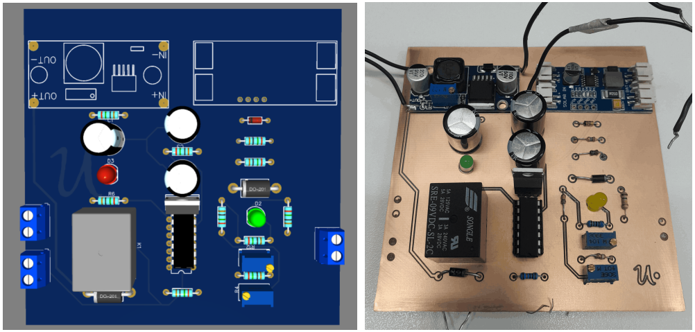

# Sistema de Carga Solar para Estación Base LoRa

Este proyecto documenta el desarrollo de mi **Práctica Profesional Supervisada (PPS)**. Consiste en el diseño y fabricación de un sistema de gestión de energía solar para una estación base de alambrado virtual, garantizando una autonomía de 48 horas.

## Objetivos Técnicos
- **Autonomía:** 2 días de operación continua sin radiación solar.
- **Carga Inteligente:** Implementación de perfiles de carga para baterías de Litio-Ion (CC/CV).
- **Eficiencia:** Selección y testeo de reguladores para maximizar la transferencia de energía desde paneles solares de 20W.

## Desarrollo e Ingeniería
El proyecto se dividió en tres pilares de investigación técnica:
1. **Paneles Solares:** Análisis de tecnologías y dimensionamiento para entornos de baja radiación.
2. **Almacenamiento:** Gestión de celdas Li-Ion, protección contra sobrecarga y descarga profunda.
3. **Cargadores:** Evolución desde circuitos discretos hasta el uso de integrados especializados con control de carga.

## Ciclo de Diseño y Validación
Una parte fundamental de este trabajo fue el **Historial de Diseños**, donde se documenta el paso de prototipos en protoboard hacia la fabricación de PCBs funcionales mediante fresado CNC. 

*(PCB final)*
Los ensayos de laboratorio validaron:
- Curvas de carga real vs. teórica.
- Consumo de corriente de la Estación Base en reposo y transmisión.
- Eficiencia del regulador bajo distintas condiciones de carga.

## Referencias
Este sistema se basa en los parámetros de la tesis *"Estación base LoRa para sistemas de alambrado virtual"* de Denis Heredia y Sebastián Busch.
